# Ana — Neuroscience-Informed Journaling & Somatic Reset System

[](https://ana-journ.ai.studio/)
[](https://cloud.google.com/run)
[](https://aistudio.google.com)
[](https://firebase.google.com)

---

## 📖 App Overview: What is Ana?

**Ana** is a production-grade, neuroscience-grounded journaling and emotional regulation web companion designed to down-regulate autonomic stress, externalize catastrophic rumination, and cultivate long-term psychological flexibility. 

Unlike traditional journaling apps that merely store passive text, Ana functions as an active neuro-cognitive coprocessor. Rooted in research across **neuroplasticity**, **affect labeling**, **polyvagal theory**, **cognitive reframing**, and **expressive writing (Pennebaker Paradigm)**, Ana guides users through structured somatic resets, synaptic pruning rituals, and psychiatric decentering exercises that physically rewire automatic stress patterns into rational prefrontal anchors.

### 🌟 Core Feature Matrix

1. **Multi-Turn Expressive Journaling & Pennebaker Synthesis**:
   - Conversational AI reflection companion that honors emotional reality without toxic positivity.
   - Generates executive cognitive summaries, key takeaways, and deep reflection questions.
2. **Psychiatric Decentering ("Vent-to-Clarity" Station)**:
   - Anti-rumination timed venting workspace with real-time word limits to prevent recursive spiraling.
   - Deconstructs emotional distress into 4 clinical pillars: **Camera-Verifiable Facts**, **Interpretive Mind-Reading Projections**, **Circle of Control Agency Mapping**, and **5-Minute Micro-Action Anchors**.
   - Integrated dual-inhalation **Physiological Sigh** grounding pacer with harmonic binaural audio.
3. **Synaptic Pruning Ritual**:
   - Analyzes automatic thoughts to identify cognitive distortions (catastrophizing, black-and-white thinking, emotional reasoning).
   - Rewires distortions into rational prefrontal anchors, concluding with an interactive particle dissolution ceremony that dissolves the loop.
4. **Polyvagal Glimmer Vault & Mining**:
   - AI-powered mining of sensory micro-moments of autonomic safety from raw journal entries.
   - Interactive 10-second vagal brake reset pacer to stimulate parasympathetic recovery.
5. **3D Somatic Reset Room**:
   - Interactive Three.js body tension mapper to pinpoint somatic holding patterns.
   - Guided 4-7-8 vagus nerve breathing pacer, tension discharge log, and cognitive perspective realigner.
6. **Circadian Loop Closure & Inactivity Alerts**:
   - Morning dopamine priming and evening cognitive loop-offloading before sleep.
   - Transactional email dispatch engine delivering compassionate re-engagement prompts when inactivity exceeds 20 hours.
7. **Empirical Telemetry & Longitudinal Synthesis**:
   - Extracts objective sleep scores, somatic tension levels, and mental clarity from reflections.
   - Multi-week synthesis engine calculating mood trajectories and neural adaptability indexes.
8. **DLP Privacy Redaction**:
   - Automatic sanitization of PII, credit cards, emails, phone numbers, and credentials before data leaves the browser.
9. **Handwritten Journal OCR**:
   - Multimodal Gemini Vision digitizer transcribing physical handwritten notes directly into structured digital reflections.
10. **Dual-Mode Google Workspace Integration**:
    - Auto-sync on save and manual CSV export to Google Sheets via Sheets API v4 and Google Apps Script.

---

## 🏛️ System Architecture

Ana implements a **Zero-Client-Key Architecture**: the browser client never receives, bundles, or directly accesses API credentials. All AI calls, database operations, and external notification dispatches are securely proxied through an Express backend running on Google Cloud Run.

```mermaid
flowchart TD
    subgraph ClientTier["Client Tier (Browser / PWA)"]
        UI["React 19 + TypeScript + Tailwind CSS\n(Neuro-Cognitive Studio)"]
        HW["Handwritten Note Capture & OCR Modal\n(Camera / File Drag-and-Drop)"]
        Three["Three.js 3D Somatic Reset Room\n(Interactive Tension Mapper)"]
        AuthClient["Firebase Auth Client\n(Google Sign-In OAuth)"]
    end

    subgraph GoogleCloudPlatform["Google Cloud Platform (asia-southeast1)"]
        subgraph CloudRun["Google Cloud Run (Serverless Container)"]
            Express["Express API Gateway & Defensive Security Layer\n(Rate Limiting, 10MB Body Bounds, Zero-Client Keys)"]
            GCSStreamer["Cloud Storage Binary Stream Engine\n(Direct Object Uploader)"]
            DLPEngine["Sensitive Data Protection (Cloud DLP)\n(7 infoTypes Redaction & Surrogate Tokenizer)"]
            GeminiProxy["Resilient Gemini Proxy & Fallback Ladder\n(Structured JSON Schema Validator)"]
            CircadianEngine["Circadian Inactivity Dispatcher\n(Loop Closure Narrative Generator)"]
        end

        subgraph StorageLayer["Google Cloud Storage"]
            GCSBucket[("Cloud Storage Bucket\ngs://ai-studio-bucket-118399207989-asia-southeast1\n/handwritten/{userId}/{imageId}.jpg")]
        end

        subgraph DatabaseLayer["Firebase & Cloud Firestore"]
            FirebaseAuth["Firebase Authentication\n(Token Verification & Cryptographic UID)"]
            FirestoreDB[("Cloud Firestore\nIsolated Collections: /users/{userId}/*\n(entries, sessions, glimmers, pruned_loops)")]
            SecurityRules{"firestore.rules\n(request.auth.uid == userId)"}
        end

        subgraph ManagementTier["Security, Scheduling & Observability"]
            SecretManager["Google Cloud Secret Manager\n(GEMINI_API_KEY, RESEND_API_KEY)"]
            Scheduler["Google Cloud Scheduler\n(Authenticated Cron: 0 */4 * * *)"]
            CloudLogging["Google Cloud Logging\n(Structured JSON Audit Trail & Latency Metrics)"]
        end

        subgraph GeminiAI["Google AI Studio / Gemini Models"]
            Gemini38["gemini-3.8-flash\n(Primary Engine: Reflection, Decentering, Affect Labeling)"]
            Gemini37["gemini-3.7-flash\n(Failover Tier 1: Multi-Step Cognitive Unwinding)"]
            Gemini36["gemini-3.6-flash\n(Failover Tier 2: Base Multimodal Engine)"]
            GeminiVision["Gemini Multimodal Vision\n(Verbatim Paleographic OCR Transcription)"]
        end
    end

    subgraph ExternalServices["External Services"]
        ResendAPI["Resend REST API\n(Transactional Inactivity Prompts)"]
        SheetsAPI["Google Sheets API v4 / Apps Script\n(Longitudinal Empirical Telemetry Sync)"]
    end

    %% Client Interactions
    UI -->|"HTTPS REST (/api/*)"| Express
    HW -->|"Base64 Image Payload"| Express
    AuthClient -->|"Google Identity Token"| FirebaseAuth
    FirebaseAuth -->|"Authenticated UID Scoping"| FirestoreDB
    Express -->|"Owner-Bound Queries"| FirestoreDB
    FirestoreDB -.->|"Access Control Enforced by"| SecurityRules

    %% Storage & DLP Data Flow
    Express -->|"1. Binary Image Stream"| GCSStreamer
    GCSStreamer -->|"Persists JPEG/PNG"| GCSBucket
    GCSBucket -.->|"Canonical gs:// URI"| Express
    Express -->|"2. Image Parts for Paleography"| GeminiVision
    GeminiVision -->|"Raw Verbatim Transcription"| Express
    Express -->|"3. PII & Sensitive Pattern Inspection"| DLPEngine
    DLPEngine -->|"Redacted Text with Surrogate Tokens"| Express
    Express -->|"4. Cleaned Reflection & Storage References"| UI

    %% Gemini Model Ladder
    Express -->|"Cognitive Reflection Prompt"| GeminiProxy
    GeminiProxy -->|"Primary Query"| Gemini38
    Gemini38 -.->|"Failover on 429/503"| Gemini37
    Gemini37 -.->|"Failover on 429/503"| Gemini36
    GeminiProxy -->|"Structured JSON Response"| Express

    %% Infrastructure & External
    SecretManager -->|"Injected at Runtime (--set-secrets)"| CloudRun
    Scheduler -->|"POST /api/scheduler/check-inactivity"| Express
    Express -->|"Structured Telemetry Logs"| CloudLogging
    CircadianEngine -->|"Loop Closure Emails"| ResendAPI
    Express -->|"Validated Webhook Export (SSRF-Guarded)"| SheetsAPI
```



---

## ☁️ Google Cloud & Google Services Integration

Ana is engineered to deeply leverage Google's managed cloud, storage, and AI ecosystem:

### 1. Google Gemini & Google AI Studio
- **What We Built**: The cognitive engine powering all emotional labeling, psychiatric decentering, synaptic pruning, glimmer discovery, and multimodal OCR transcription.
- **How It's Used**: Powered by `@google/genai` on Node.js 24 with custom system instructions (Constitution) enforcing empathetic, non-diagnostic boundaries.
- **Resilient Fallback Ladder**:
  - Primary: `gemini-3.8-flash`
  - Fallback 1: `gemini-3.7-flash`
  - Fallback 2: `gemini-3.6-flash`
- **Structured Schema Outputs**: All responses use strict JSON Schema mode with defensive server-side parsing.

### 2. Google Cloud Storage (GCS)
- **What We Built**: Persistent, regional cloud object storage for handwritten notebook spreads, paper journal photos, and physical sketches.
- **Canonical Bucket**: `gs://ai-studio-bucket-118399207989-asia-southeast1`
- **Storage Hierarchy**: Stored under isolated, user-partitioned paths:
  ```
  gs://ai-studio-bucket-118399207989-asia-southeast1/handwritten/{userId}/{imageId}.jpg
  ```
- **How It's Used**: 
  - Users capture or upload paper journal photos in the **Handwritten OCR Modal**.
  - The Express backend parses the image payload and directly streams binary buffers to the Google Cloud Storage JSON API (`POST https://storage.googleapis.com/upload/storage/v1/b/.../o?uploadType=media`).
  - Returns canonical `gs://...` URIs alongside public media links for long-term archival.
- **IAM & Cloud Run Permissions**: 
  - In production, Cloud Run's default compute service account (`${PROJECT_NUMBER}-compute@developer.gserviceaccount.com`) automatically possesses write access to project buckets.
  - To test direct writes in the development sandbox prior to publishing, grant `roles/storage.objectAdmin` to `ais-sandbox@ais-asia-southeast1-6b362d59ea.iam.gserviceaccount.com`.

### 3. Google Cloud Sensitive Data Protection (Cloud DLP)
- **What We Built**: Automated privacy and PII redaction pipeline protecting sensitive emotional, financial, and personal details in journal entries and transcribed notebook photos.
- **How It's Used**: 
  - Analyzes raw OCR transcriptions and user entries across 7 core infoTypes before data is persisted to Cloud Firestore or displayed in the UI:
    - `PERSON_NAME` — Identifies personal names via title detection, introductory phrases, and clinician roles.
    - `EMAIL_ADDRESS` — Standard RFC 5322 regex sanitization.
    - `PHONE_NUMBER` — North American, international, and mobile dialing patterns.
    - `CREDIT_CARD_NUMBER` — Luhn-compatible payment card numbers.
    - `US_SOCIAL_SECURITY_NUMBER` — 9-digit government identifier patterns.
    - `PHYSICIAN_PROVIDER` — Names following therapist, psychiatrist, counselor, or physician titles.
    - `API_KEY_OR_SECRET` — High-entropy secret patterns (`AIzaSy...`, `sk-...`, `re_...`).
  - **Surrogate Tokenization**: Replaces detected infoTypes with non-reversible surrogate tokens (e.g. `[REDACTED_NAME]`, `[REDACTED_EMAIL]`, `[REDACTED_PHONE]`) to preserve semantic coherence for Gemini without exposing raw private identifiers.
  - **Endpoints**: Seamlessly integrated into `/api/journal/handwritten-ocr` (enabled by default with toggle) and accessible as a standalone utility via `POST /api/privacy/redact-dlp`.

### 4. Firebase Authentication
- **What We Built**: Zero-friction Google OAuth identity verification.
- **How It's Used**: Authenticates users and mints cryptographic ID tokens. The authenticated `uid` serves as the strict security boundary for all downstream database subcollections.

### 5. Google Cloud Firestore
- **What We Built**: Persistent, real-time NoSQL storage for all user reflections, somatic states, pruned thoughts, and longitudinal telemetry.
- **How It's Used**: Structured under isolated subcollections:
  - `/users/{userId}/entries` — Journal reflections & empirical telemetry
  - `/users/{userId}/sessions` — Somatic reset room records
  - `/users/{userId}/pruned_loops` — Rewired cognitive distortion anchors
  - `/users/{userId}/glimmers` — Autonomic safety anchors
  - `/users/{userId}/psychiatric_distillations` — Vent-to-Clarity decentered records
  - `/users/{userId}/circadian_entries` — Day boundary check-ins
- **Security Rules**: Guarded by `firestore.rules` enforcing `request.auth.uid == userId`.

### 6. Google Cloud Run
- **What We Built**: The containerized full-stack deployment serving the React 19 single-page application and the Express API gateway.
- **How It's Used**: Hosted on managed Cloud Run (`asia-southeast1`). Provides auto-scaling from 0 to peak, TLS termination, request deserialization with strict 10MB limits, and complete proxy isolation so no API keys reach the client.

### 7. Google Cloud Secret Manager
- **What We Built**: Secure credential storage protecting production keys.
- **How It's Used**: Stores `GEMINI_API_KEY` and `RESEND_API_KEY`. Secrets are dynamically bound into Cloud Run environment variables at runtime via `--set-secrets`, preventing secrets from ever touching source control or container images.

### 8. Google Cloud Scheduler
- **What We Built**: Automated circadian loop closure notification triggers.
- **How It's Used**: An authenticated serverless HTTP cron job (`0 */4 * * *`) invoking `/api/scheduler/check-inactivity` on Cloud Run to evaluate user elapsed time and dispatch loop-closure prompts.

### 9. Google Cloud Logging
- **What We Built**: Centralized observability and runtime audit trail.
- **How It's Used**: Emits structured JSON logs containing request IDs, latency metrics, fallback model transitions, and notification dispatch statuses.

---

## 🛡️ Cloud Firestore Security Rules

To guarantee complete cross-user data isolation and zero cross-tenant data leakage, the following security rules are enforced at the Firestore database boundary:

```javascript
rules_version = '2';
service cloud.firestore {
  match /databases/{database}/documents {
    // Zero Insecure Defaults: strict user-isolation rule
    match /users/{userId} {
      allow read, write: if request.auth != null && request.auth.uid == userId;

      match /interactions/{interactionId} {
        allow read, write: if request.auth != null && request.auth.uid == userId;
      }

      match /entries/{entryId} {
        allow read, write: if request.auth != null && request.auth.uid == userId;
      }

      match /sessions/{sessionId} {
        allow read, write: if request.auth != null && request.auth.uid == userId;
      }

      match /pruned_loops/{loopId} {
        allow read, write: if request.auth != null && request.auth.uid == userId;
      }

      match /glimmers/{glimmerId} {
        allow read, write: if request.auth != null && request.auth.uid == userId;
      }

      match /{document=**} {
        allow read, write: if request.auth != null && request.auth.uid == userId;
      }
    }
  }
}
```

---

## 📜 Google AI Studio Setup & System Directives (Constitution)

Ana uses Google AI Studio system instructions to enforce grounded clinical empathy, tone directives, and strict schema compliance.

```text
You are Ana, an empathetic, neuroscience-grounded journaling and cognitive reflection companion.
Principles:
1. Grounded Empathy: Acknowledge emotional reality without toxic positivity or dismissive cheerfulness.
2. Neuroscience Foundation: Use affect labeling, cognitive reframing, and polyvagal theory to ground the user.
3. No Clinical Diagnostics: Never diagnose psychiatric disorders or prescribe medical interventions. Offer somatic grounding and perspective shifts.
4. Schema Strictness: Always respond using the requested structured JSON schema.
```

---

## 🔐 Google Cloud Secret Manager Configuration

Configure API keys securely in Secret Manager:

```bash
# 1. Enable Google Cloud APIs
gcloud services enable run.googleapis.com secretmanager.googleapis.com

# 2. Create Gemini API Key secret
gcloud secrets create GEMINI_API_KEY --replication-policy="automatic"
echo -n "YOUR_GEMINI_API_KEY" | gcloud secrets versions add GEMINI_API_KEY --data-file=-

# 3. Create Resend API Key secret (for Circadian transactional email reminders)
gcloud secrets create RESEND_API_KEY --replication-policy="automatic"
echo -n "YOUR_RESEND_API_KEY" | gcloud secrets versions add RESEND_API_KEY --data-file=-

# 4. Grant Cloud Run Service Account permissions to access secrets
PROJECT_NUMBER=$(gcloud projects describe $(gcloud config get-value project) --format="value(projectNumber)")
gcloud secrets add-iam-policy-binding GEMINI_API_KEY \
  --member="serviceAccount:${PROJECT_NUMBER}-compute@developer.gserviceaccount.com" \
  --role="roles/secretmanager.secretAccessor"

gcloud secrets add-iam-policy-binding RESEND_API_KEY \
  --member="serviceAccount:${PROJECT_NUMBER}-compute@developer.gserviceaccount.com" \
  --role="roles/secretmanager.secretAccessor"
```

---

## 🚀 Google Cloud Run Deployment Guide

Deploy Ana directly to Cloud Run with automated secret bindings:

```bash
# 1. Deploy service with Secret Manager bindings
gcloud run deploy ana-neuro-journal \
  --source . \
  --platform managed \
  --region asia-southeast1 \
  --allow-unauthenticated \
  --set-secrets="GEMINI_API_KEY=GEMINI_API_KEY:latest,RESEND_API_KEY=RESEND_API_KEY:latest" \
  --set-env-vars="NODE_ENV=production,RESEND_FROM_EMAIL=Ana Journal <onboarding@resend.dev>"

# 2. Configure Google Cloud Scheduler for Circadian Inactivity Checks (every 4 hours)
SERVICE_URL=$(gcloud run services describe ana-neuro-journal --region=asia-southeast1 --format="value(status.url)")

gcloud scheduler jobs create http ana-circadian-cron \
  --schedule="0 */4 * * *" \
  --uri="${SERVICE_URL}/api/scheduler/check-inactivity" \
  --location=asia-southeast1 \
  --http-method=POST \
  --message-body='{"thresholdHours":20}' \
  --headers="Content-Type=application/json"
```

---

## 📧 Resend API Transactional Email Setup

Ana includes a transactional email dispatch service that prompts users to close cognitive loops when inactive for over 20 hours:

1. Create a free API key at [resend.com/api-keys](https://resend.com/api-keys) (3,000 free emails/month).
2. **Resend Free Tier Rule**: In free sandbox mode, Resend sends from `onboarding@resend.dev` and **only delivers to the email address registered on your Resend account**.
3. In Ana's Settings workspace, input your Resend account email as the **Recipient Email Address** to receive live alerts.
4. Check your **Spam / Junk** folder if the email does not appear in your Primary inbox.

---

## 💻 Local Development & Build Commands

### Prerequisites
- Node.js 20+ (Node 24 recommended)
- npm 10+
- Google Cloud SDK (`gcloud`)

### Installation
```bash
# Clone the repository
git clone https://github.com/rafifernandaa/ana.git
cd ana

# Install dependencies
npm install

# Setup local environment variables (.env)
cp .env.example .env
# Fill in GEMINI_API_KEY, FIREBASE credentials, and optional RESEND_API_KEY
```

### Commands
| Command | Description |
| :--- | :--- |
| `npm run dev` | Runs the full-stack app locally using Vite middleware on Express (`localhost:3000`) |
| `npm run lint` | Runs type checks across the entire codebase (`tsc --noEmit`) |
| `npm run build` | Builds Vite frontend into `dist/` and bundles `server.ts` into `dist/server.cjs` via esbuild |
| `npm start` | Runs the compiled production server (`node dist/server.cjs`) |
| `npm run clean` | Removes compiled artifacts (`dist/`) |

---

## 🔒 5-Zone Threat Modeling & Security Matrix

| Threat Zone | Identified Risk | Implemented Countermeasure |
| :--- | :--- | :--- |
| **Input Surfaces** | Prompt injection, PII leakage, malformed payloads | DLP sanitization regex filter, body bounds (`10mb` limit), strict schema validation. |
| **Planning & Reasoning** | Rate limits (429), model unavailability (503), hallucination | 3-tier fallback ladder (`gemini-3.8-flash` → `gemini-3.7-flash` → `gemini-3.6-flash`). |
| **Tool Execution** | SSRF, privilege escalation, unauthenticated endpoints | Server-side API proxying (`/api/gemini/*`); zero client-side credential exposure. |
| **Memory & State** | Cross-tenant data leakage in Firestore | Strict owner-bound security rules (`request.auth.uid == userId`) across all subcollections. |
| **Inter-System Comm** | API key leakage in client bundles, network sniffing | Dynamic secret resolution via Google Cloud Secret Manager at runtime. |

---

## 📄 License
Licensed under the Apache-2.0 License.
